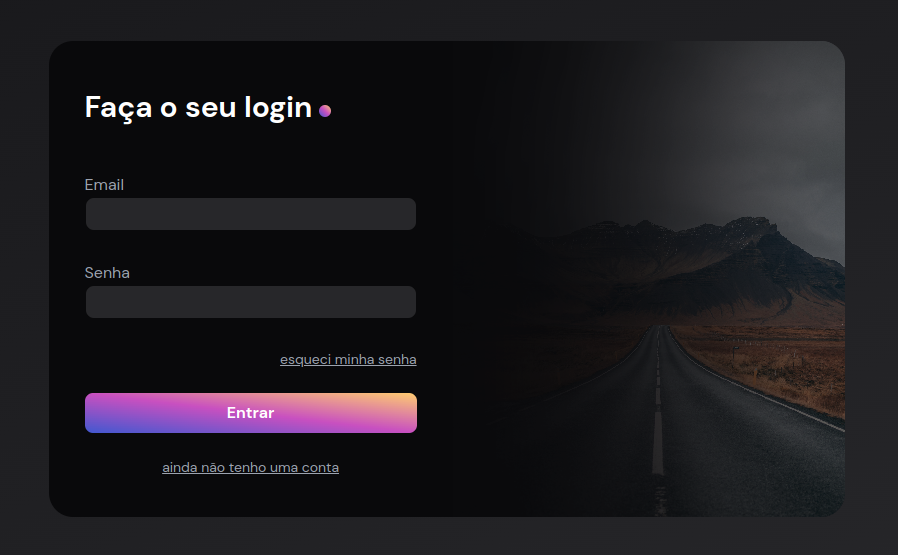

# [💻 A tela de login mais bonita do mundo com Tailwind CSS](https://codante.io/mini-projetos/mp-tela-login-tailwind)

## Projeto Tela de Login da <a href="https://codante.io/" target="_blank">Codante.io</a>

 

### Veja à tela de login mais bonita do mundo: <a href="#" target="_blank">site</a>

 

Nesse, projeto foi desenvolvido uma tela de login, apelidade de à mais bonita do mundo usando o framework <strong>Tailwind CSS</strong>.

## 🔨 Requisitos do Projeto:
- Crie uma tela de login responsiva, que se adapte a diferentes tamanhos de tela.
- Utilize o framework Tailwind CSS para estilizar os elementos da tela de login.
- A tela de login deve conter os seguintes elementos:
  - Campo de entrada para o nome de usuário.
  - Campo de entrada para a senha.
  - Botão "Entrar" para fazer o login.
- Implemente a validação dos campos de entrada. Caso algum campo esteja vazio, exiba uma mensagem de erro.
- Após o usuário fazer o login com sucesso, redirecione-o para uma página de boas-vindas.
- Capriche no design! Use sua criatividade para criar uma interface atraente e amigável, aproveitando os recursos oferecidos pelo Tailwind CSS.

## 🎨 Design Final

